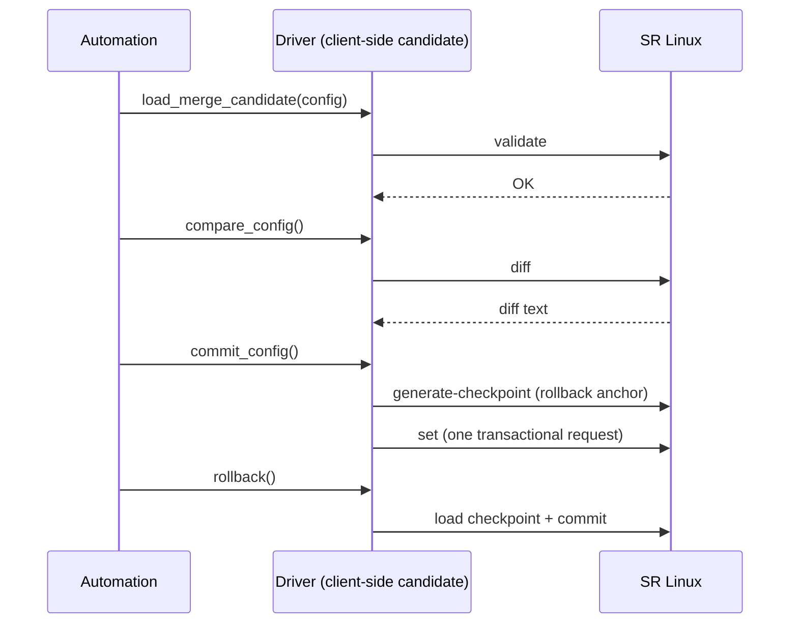

# Configuration management

The driver implements the full NAPALM candidate-config workflow: load a change, inspect the diff, commit it, and roll back if needed.

```python
device.load_merge_candidate(config='set / system information location "lab"')
print(device.compare_config())   # what would change
device.commit_config()           # apply it
device.rollback()                # restore the pre-commit state
```

## How it works under the hood

The JSON-RPC interface has **no persistent candidate datastore across requests** - a `set` request against the candidate datastore is transactional and commits on success. The NAPALM candidate workflow is therefore emulated client-side:



What this means for each method:

- **`load_merge_candidate()` / `load_replace_candidate()`** store the intended change *in the driver* and (for JSON configs) validate it on the device via the JSON-RPC `validate` method - nothing is applied yet.
- **`compare_config()`** uses the JSON-RPC `diff` method (JSON configs) or a throwaway named candidate on the device (CLI configs).
- **`commit_config()`** first creates a named checkpoint (`NAPALM-<session>-<n>`, unique per driver instance) as the rollback anchor, then applies everything in one transactional request.
- **`discard_config()`** only clears the client-side state; it never touches the device.
- **`rollback()`** restores the checkpoint created by the last `commit_config()`.

/// warning | Checkpoints snapshot everything
Checkpoints contain the **entire** configuration tree. `rollback()` restores the device to the state at the last `commit_config()` - any change made by anyone after that checkpoint is reverted too.
///

/// note | No locking
Because the candidate is client-side, no lock is held on the device. Concurrent clients are not blocked - and not protected - against each other.
///

## Accepted config formats

`load_merge_candidate()` and `load_replace_candidate()` take a `filename` or a `config` string in any of three formats; the driver detects the format automatically.

/// tab | Native SR Linux JSON

A JSON document as found in the running config. A merge is interpreted as `update /`, a replace as `replace /`.

```python
device.load_merge_candidate(config="""
{
  "system": {
    "information": {"location": "lab"}
  }
}
""")
```

///
/// tab | gNMI-style envelope

A JSON object with `updates`, `replaces` and/or `deletes` lists, each entry carrying a `path` and (except deletes) a `value`. This gives you path-level control in a single candidate.

```python
device.load_merge_candidate(config="""
{
  "updates": [
    {"path": "/system/information", "value": {"location": "lab"}}
  ],
  "deletes": [
    {"path": "/system/banner"}
  ]
}
""")
```

`load_replace_candidate()` accepts only `replaces` in this format.
///
/// tab | SR Linux CLI

Plain CLI commands, one per line - anything that is not valid JSON is treated as CLI.

```python
device.load_merge_candidate(config="""
set / system information location "lab"
set / system banner login-banner "managed by NAPALM"
""")
```

///

JSON candidates are validated on the device at load time, so a malformed change fails in `load_*_candidate()` rather than in `commit_config()`. A merge onto a pending candidate validates the full accumulated candidate - exactly what `commit_config()` would send - so a merge may reference config staged by an earlier load. CLI candidates are validated when they are diffed or committed.

/// note

Consecutive loads accumulate into one candidate: a `load_merge_candidate()` layers onto whatever is already pending, while a `load_replace_candidate()` starts a fresh baseline (discarding any prior accumulation). A `load_merge_candidate()` in a different format (CLI vs JSON) than the pending candidate is rejected - `discard_config()` first. A `load_replace_candidate()` may use any format, since it starts fresh.

///

## Committing

```python
device.commit_config(message="change ticket #1234")
```

- The `message` is recorded as the checkpoint comment (and the commit comment for CLI candidates).
- With the [`commit_save`](connection.md#all-optional-arguments) optional argument, commits use `commit save` / `save startup`, so the change also persists into the startup configuration.
- `commit_config(revert_in=...)` starts a [confirmed commit](commit-confirm.md) with an automatic revert timer.
